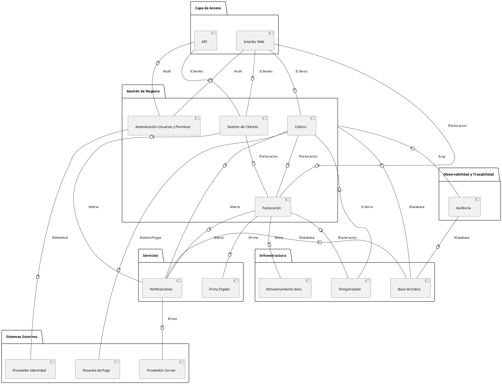

# Código PlantUML: Diagrama de Componentes

**Proyecto:** Gestor de facturas Turbine
**Grupo:** Ramón Llull · 3º B

```plantuml
@startuml
skinparam componentStyle uml2
skinparam nodesep 80
skinparam ranksep 110
skinparam padding 15

package "Capa de Acceso" {
  [API] as api
  [Interfaz Web] as web
}

package "Gestión de Negocio" as pGestion {
  [Autenticación Usuarios y Permisos] as users
  [Gestión de Clientes] as clients
  [Facturación] as fact
  [Cobros] as cob
}

package "Servicios" {
  [Firma Digital] as sign
  [Notificaciones] as notif
}

package "Infraestructura" {
  [Base de Datos] as database
  [Temporizador] as temp
  [Almacenamiento docs] as almacenamiento
}

package "Sistemas Externos" {
  [Proveedor Identidad] as identity
  [Pasarela de Pago] as pagos
  [Proveedor Correo] as correo
}

package "Observabilidad y Trazabilidad" {
  [Auditoría] as aud
}

' Entradas
web -(0- users : IAuth
api -(0- users : IAuth
web -(0- clients : IClientes
api -(0- clients : IClientes
web -(0- fact : IFacturacion
web -(0- cob : ICobros

' Negocio
clients -(0- fact : IFacturacion
cob -(0- fact : IFacturacion

' Servicios
fact -(0- sign : IFirma
clients -(0- notif : IAlerta
fact -(0- notif : IAlerta
cob -(0- notif : IAlerta

' Infraestructura
temp -(0- fact : IFacturacion
temp -(0- cob : ICobros
fact -(0- almacenamiento : IDocs
pGestion -(0- database : IDatabase
notif -(0- database : IDatabase
aud -(0- database : IDatabase

' Trazabilidad centralizada
pGestion -(0- aud : ILog

' Externos
notif -(0- correo : IEnvío
cob -(0- pagos : IGestionPagos
users -(0- identity : IIdentidad

@enduml
```
